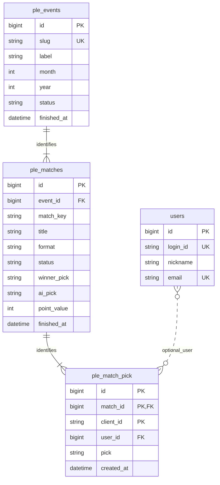

# Kayfabe ERD

WWE PLE(프리미엄 라이브 이벤트) 예측·결과를 Neon Postgres에 저장하는 Kayfabe 도메인 스키마입니다.  
ORM: `backend/apps/kayfabe/app/models/ple_model.py` · 회원 FK: `secom` `users` 테이블.

물리 PK·`id` 인조키 규칙은 [`ENTITY_RULE.md`](ENTITY_RULE.md)를 따릅니다. 본 문서의 **논리 ER**은 비즈니스 식별자·식별관계 기준이며, ORM은 조인 편의를 위해 모든 테이블에 `id`를 둡니다.

---

## PK · 인조키 정책

| 테이블 | 논리 PK (비즈니스) | 물리 PK (ORM·Neon) | `id` 인조키 |
|--------|-------------------|-------------------|-------------|
| `ple_events` | `slug` | `id` + `slug` UK | **불필요** (논리). 물리는 ENTITY_RULE로 `id` 유지 |
| `ple_matches` | `(event_id, match_key)` | `id` + UK `(event_id, match_key)` | **불필요** (논리). FK `event_id`가 부모 식별자 |
| `ple_match_pick` (교차) | `(match_id, client_id)` | 물리 테이블 `ple_predictions` · `id` + UK | 경기·브라우저 참가를 연결. `user_id`는 PK 밖 FK |
| `users` (Secom) | `id` | `id` | **필요** (외부 도메인) |

- **논리:** 자식 행은 부모 없이 존재할 수 없으면 PK에 부모 FK(또는 slug)가 포함되는 **식별관계**로 모델링한다.
- **물리:** [`ENTITY_RULE.md`](ENTITY_RULE.md)에 따라 **모든 테이블**에 `int id` autoincrement PK를 둔다. 비즈니스 중복 방지는 **UK**로 처리한다.

---

## 식별 · 비식별 관계

| 부모 | 자식 | 유형 | 설명 |
|------|------|------|------|
| `ple_events` | `ple_matches` | **식별** | 경기는 이벤트 없이 정의되지 않음. 논리 PK에 `event_id`(또는 `slug`) 포함 |
| `ple_matches` | `ple_match_pick` | **식별** | 픽(예측)은 경기 없이 없음. 논리 PK `(match_id, client_id)` |
| `users` | `ple_match_pick` | **비식별** | `user_id`는 PK에 **미포함**, NULL 허용. 픽 행은 브라우저(`client_id`)만으로 존재 가능 · 회원 삭제 시 SET NULL |

| 부모 → 자식 | 유형 | Mermaid (중간) | 렌더 |
|-------------|------|----------------|------|
| `ple_events` → `ple_matches` | 식별 | `\|\|--\|{` | **실선** |
| `ple_matches` → `ple_match_pick` | 식별 | `\|\|--\|{` | **실선** |
| `users` → `ple_match_pick` | 비식별 | `}o..o{` | **점선** |

```text
식별:     자식.PK ⊃ 부모 FK(또는 slug)   CASCADE              Mermaid 중간: --
비식별:   자식.FK only, PK 밖           users 삭제 → SET NULL   Mermaid 중간: ..
```

> `}o..o{`는 M:N 전용이 아닙니다. Mermaid 예시(`PERSON }o..o{ NAMED-DRIVER`)처럼 **교차 엔티티로의 비식별 1:N**에도 점선을 씁니다.

---

## 교차 엔티티 (`ple_match_pick`)

`users`와 `ple_matches`는 **직접 M:N이 아닙니다.** 한 회원이 여러 경기에, 한 경기에 여러 참가자(브라우저·회원)가 예측할 수 있어 **논리적으로 M:N**처럼 보이지만, 이를 풀기 위한 **교차(연관) 엔티티**가 `ple_match_pick`입니다.

| 구분 | 설명 |
|------|------|
| 논리 이름 | `ple_match_pick` — 「한 경기 + 한 참가(브라우저)」당 승자 예측 1건 |
| 물리 테이블 | **`ple_predictions`** (별도 junction 테이블 없음, 1테이블이 교차 엔티티 역할) |
| 경기 쪽 | `match_id` FK · UK `(match_id, client_id)` → 경기에 **식별** |
| 회원 쪽 | `user_id` FK (선택) → 회원에 **비식별** · 로그인 후 `attach_user_id`로 연결 |
| M:N 해소 | `ple_matches` **1:N** `ple_match_pick` **N:1** `users` (회원 미연결 행은 `user_id` NULL) |

```text
ple_matches ══1:N══► ple_match_pick ◄··0:N·· users
              (실선·식별)   (교차)      (점선·비식별)
              물리: ple_predictions
```

---

## ER 다이어그램

Neon·SQLAlchemy 실제 스키마(`ple_model.py`). 데이터는 **이벤트 → 경기 → 교차 엔티티(예측 픽)** 순으로 이어지며, 방송 **결과**는 `ple_matches.winner_pick`, 참가자 **예측**은 물리 테이블 `ple_predictions`(`ple_match_pick`)에 쌓입니다.

> **Obsidian:** 라이브 프리뷰에서 Mermaid `erDiagram`이 렌더됩니다.

**관계선 (Mermaid):** 가운데 `--` → **실선(식별)** · `..` → **점선(비식별)**. 양끝 `||--|{` / `}o..o{`는 카디널리티이며, 선 종류와는 별개입니다.

| 논리 ER | 물리 테이블 | 논리 PK (UK) | 물리 PK |
|---------|-------------|---------------|---------|
| `ple_events` | `ple_events` | `slug` | `id` |
| `ple_matches` | `ple_matches` | `(event_id, match_key)` | `id` |
| **`ple_match_pick`** | **`ple_predictions`** | `(match_id, client_id)` | `id` |
| `users` (Secom) | `users` | `id` | `id` |



관계 라벨: `identifies` = 식별(실선 `--`) · `optional_user` = 비식별(점선 `..`). `match_id`는 논리 PK·FK, `user_id`는 FK만(PK 아님).

**UK:** `ple_matches` · `uq_ple_event_match_key` → `(event_id, match_key)` · `ple_predictions` · `uq_ple_prediction_match_client` → `(match_id, client_id)` · `uq_predictions_match_user` → `(match_id, user_id)` (`user_id` **NOT NULL**일 때 경기당 회원 1건)

---

## 카디널리티

| 관계 | ER 표기 | 유형 | Mermaid | 의미 |
|------|---------|------|---------|------|
| `ple_events` → `ple_matches` | **1 : N** | 식별 | `\|\|--\|{` 실선 | 한 PLE에 여러 경기 · 논리 PK에 `event_id` |
| `ple_matches` → `ple_match_pick` | **1 : N** | 식별 | `\|\|--\|{` 실선 | 한 경기에 여러 참가(브라우저) 픽 · 논리 PK `(match_id, client_id)` |
| (경기 + `client_id`) → 픽 | **1 : 1** | — | — | 브라우저당 경기 1회 (`uq_ple_prediction_match_client`) |
| (경기 + `user_id`) | **1 : 1** | — | — | 로그인·`user_id` NOT NULL 시 경기당 1회 (`uq_predictions_match_user`) |
| `users` → `ple_match_pick` | **0 : N** | 비식별 | `}o..o{` 점선 | 회원당 여러 픽 · `user_id` NULL 픽은 회원 엔티티와 무관 |

---

## 제약 조건

| 이름 | 테이블 | 규칙 |
|------|--------|------|
| `uq_ple_event_match_key` | `ple_matches` | `(event_id, match_key)` 유일 |
| `uq_ple_prediction_match_client` | `ple_predictions` | `(match_id, client_id)` 유일 |
| `uq_predictions_match_user` | `ple_predictions` | `(match_id, user_id)` 유일 (`user_id` NOT NULL인 행만 적용) |
| FK CASCADE | `ple_matches` → `ple_events` | 이벤트 삭제 시 경기·예측 연쇄 삭제 |
| FK CASCADE | `ple_predictions` → `ple_matches` | 경기 삭제 시 예측 연쇄 삭제 |
| FK SET NULL | `ple_predictions.user_id` → `users` | 회원 삭제 시 `user_id`만 NULL |

---

## 테이블 · 필드 설명

### `ple_events` (`PleEventModel`)

| 필드 | 타입 | 키 | 설명 |
|------|------|-----|------|
| id | bigint | PK (물리) | ENTITY_RULE 인조키 |
| slug | varchar(64) | UK · **논리 PK** | URL·프론트 식별자 |
| label | varchar(120) | | 표시 이름 |
| month | int | | PLE 월별 순서 |
| year | int | | 연도 |
| status | varchar(20) | | `upcoming` · `live` · `finished` |
| finished_at | timestamptz | | 이벤트 종료 시각 |
| created_at | timestamptz | | 생성 |
| updated_at | timestamptz | | 갱신 |

### `ple_matches` (`PleMatchModel`)

| 필드 | 타입 | 키 | 설명 |
|------|------|-----|------|
| id | bigint | PK (물리) | ENTITY_RULE 인조키 |
| event_id | bigint | FK · **논리 PK 일부** | `ple_events.id` |
| match_key | varchar(80) | **논리 PK 일부** | 프론트 카드 `id` |
| title | varchar(200) | | 경기 제목 |
| format | varchar(20) | | `singles` · `multi` |
| card_variant | varchar(10) | | `sideA` · `sideB` |
| sort_order | int | | 카드 정렬 |
| card_json | text | | 선수·배당 JSON |
| status | varchar(20) | | `scheduled` · `live` · `finished` |
| winner_pick | varchar(20) | | 방송 결과 |
| winner_name | varchar(200) | | 승자 표시명 |
| ai_pick | varchar(20) | | AI 예측 |
| ai_pick_name | varchar(200) | | AI 예측 표시명 |
| ai_correct | boolean | | AI 정답 여부 |
| point_value | int | | 순위 가중치 |
| finished_at | timestamptz | | 결과 확정 시각 |
| created_at | timestamptz | | 생성 |
| updated_at | timestamptz | | 갱신 |

### `ple_match_pick` · 물리 `ple_predictions` (`PlePredictionModel`)

논리 **교차 엔티티**. ORM·Neon 테이블명은 `ple_predictions`입니다.

| 필드 | 타입 | 키 | 설명 |
|------|------|-----|------|
| id | bigint | PK (물리) | ENTITY_RULE 인조키 |
| match_id | bigint | FK · **논리 PK 일부** | `ple_matches.id` |
| client_id | varchar(64) | **논리 PK 일부** | 브라우저(비로그인 참가) 식별 |
| user_id | bigint | FK (비식별) | `users.id`, NULL 허용 · 로그인 연동 |
| pick | varchar(20) | | `left` · `right` · `"0"`… |
| created_at | timestamptz | | 예측 시각 |

### `users` (Secom, 참조)

| 필드 | 타입 | 키 | 설명 |
|------|------|-----|------|
| id | bigint | PK | 외부 도메인 인조키 |
| login_id | varchar | UK | 로그인 ID |
| nickname | varchar | | 닉네임 |
| email | varchar | UK | 이메일 |

---

## 상태 값

| 구분 | 값 | 용도 |
|------|-----|------|
| 이벤트 status | upcoming, live, finished | PLE 전체 |
| 경기 status | scheduled, live, finished | 개별 매치 |
| pick / winner_pick | left, right, 0..n | singles / multi |

---

## `card_json` 구조 (요약)

| format | 주요 키 |
|--------|---------|
| singles | `left`, `right`, `bookmakerDecimal` |
| multi | `competitors[]`, `bookmakerDecimal` |

---

## 레이어드 구조 (`backend/apps/kayfabe`)

| 레이어 | 경로 | 역할 |
|--------|------|------|
| Controller | `app/controllers/ple_controller.py` | API 진입 |
| Service | `app/services/ple_service.py` | 동기화·보드·예측 |
| Repository | `app/repositories/ple_repository.py` | Neon CRUD |
| Model | `app/models/ple_model.py` | ORM |
| Schema | `app/schemas/ple_schema.py` | DTO |

흐름: **Controller → Service → Repository → Neon**

---

## HTTP API (`main.py`)

| 메서드 | 경로 | DB 영향 |
|--------|------|---------|
| GET | `/ple/events` | `ple_events` |
| GET | `/ple/{slug}` | events + matches + predictions |
| POST | `/ple/{slug}/sync-from-client` | events·matches upsert |
| POST | `/ple/{slug}/matches/{match_key}/predict` | `ple_predictions` |
| POST | `/ple/{slug}/matches/{match_key}/result` | `ple_matches` 결과 |
| GET | `/ple/{slug}/live` | SSE 스냅샷 |

---

## 프론트 연동

| 화면 | 경로 | API |
|------|------|-----|
| PLE 목록·예측 | `/ple`, `/ple/[slug]` | sync, predict, live |
| 결과 등록 | `/results`, `/results/[slug]` | sync, result |

---

## 3NF · ER 체크리스트

- [ ] 논리 PK: `slug` · `(event_id, match_key)` · `(match_id, client_id)` — 교차 엔티티 `ple_match_pick`
- [ ] 물리: 모든 테이블 `id` PK · 교차 엔티티 = `ple_predictions` ([`ENTITY_RULE.md`](ENTITY_RULE.md))
- [ ] `ple_events` → `ple_matches` → `ple_match_pick` **식별관계**
- [ ] `users` → `ple_match_pick` **1:N 비식별** (M:N 아님 · `user_id` FK만)
- [ ] UK: `uq_ple_event_match_key`, `uq_ple_prediction_match_client`, `uq_predictions_match_user`
