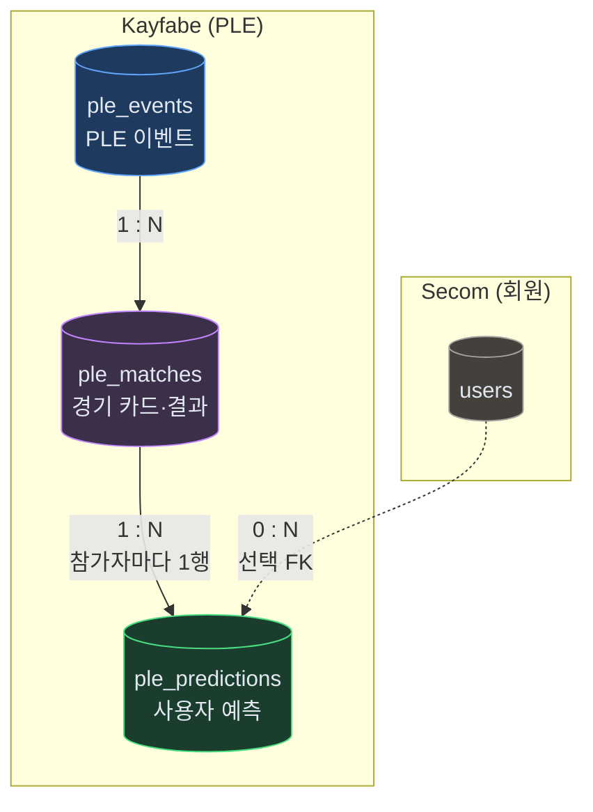
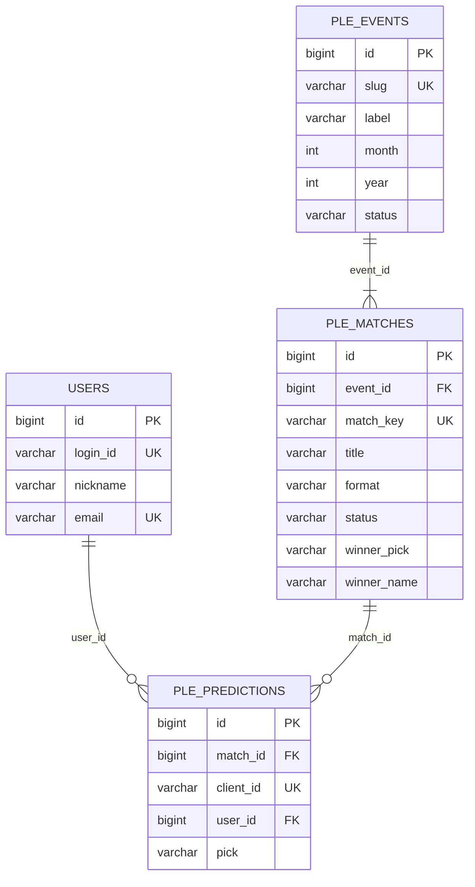
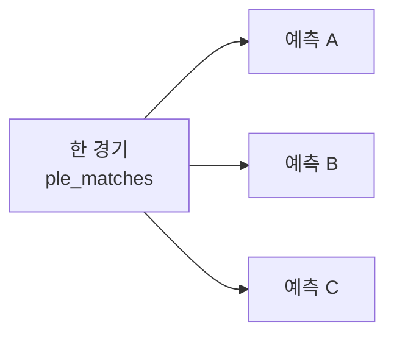

# Kayfabe ERD

WWE PLE(프리미엄 라이브 이벤트) 예측·결과를 Neon Postgres에 저장하는 Kayfabe 도메인 스키마입니다.  
ORM: `backend/apps/kayfabe/app/models/ple_model.py` · 회원 FK: `secom` `users` 테이블.

---

## 한눈에 보기

데이터는 **이벤트 → 경기 → 예측** 순으로 이어집니다. 방송 **결과**는 `ple_matches`에 저장하고, 사용자 **예측**은 `ple_predictions`에 쌓입니다.

| 단계 | 테이블 | 하는 일 |
|------|--------|---------|
| 1 | `ple_events` | Royal Rumble, WrestleMania 등 PLE 단위 |
| 2 | `ple_matches` | 카드 JSON, 방송 승자(`winner_pick`) |
| 3 | `ple_predictions` | 브라우저·회원별 승자 예측(`pick`) |

---

## ER 다이어그램 (관계 + 핵심 컬럼)

상세 컬럼은 아래 **테이블 · 필드 설명**을 보세요. 다이어그램에는 PK·FK·UK만 표기했습니다.

> **UK 표기:** `ple_matches`의 `match_key`는 `(event_id, match_key)` 복합 유니크.  
> `ple_predictions`의 `client_id`는 `(match_id, client_id)` 복합 유니크.

---

## 카디널리티 (자주 헷갈리는 부분)

| 관계 | ER 표기 | 의미 |
|------|---------|------|
| PLE_EVENTS → PLE_MATCHES | **1 : N** | 한 PLE에 여러 경기 카드 |
| PLE_MATCHES → PLE_PREDICTIONS | **1 : N** | 한 경기에 **여러 사람**이 각자 예측 |
| (경기 + client_id) → 예측 | **1 : 1** | 같은 사람은 같은 경기에 **한 번만** 예측 (`uq_ple_prediction_match_client`) |
| USERS → PLE_PREDICTIONS | **0 : N** | 로그인 시 `user_id` 연결, 비로그인은 NULL |

**1 : N인 이유:** 사이트 투표·순위를 위해 참가자마다 `ple_predictions` 행이 하나씩 필요합니다. 경기당 예측이 전체 1건(1 : 1)이면 한 명만 예측하는 구조가 됩니다.

---

## 제약 조건

| 이름 | 테이블 | 규칙 |
|------|--------|------|
| `uq_ple_event_match_key` | `ple_matches` | 같은 이벤트 안에서 `match_key` 중복 불가 |
| `uq_ple_prediction_match_client` | `ple_predictions` | 같은 경기·같은 `client_id` 중복 불가 |
| FK CASCADE | `ple_matches` → `ple_events` | 이벤트 삭제 시 경기·예측 연쇄 삭제 |
| FK CASCADE | `ple_predictions` → `ple_matches` | 경기 삭제 시 예측 연쇄 삭제 |

---

## 테이블 · 필드 설명

### `ple_events` (`PleEventModel`)

| 필드 | 타입 | 설명 |
|------|------|------|
| id | bigint PK | 내부 ID |
| slug | varchar(64) UK | URL·프론트 식별자 (예: `wrestlemania`, `royal-rumble`) |
| label | varchar(120) | 표시 이름 (예: WrestleMania) |
| month | int | 월 (1~11, WWE PLE 월별 순서) |
| year | int | 연도 (기본 2026) |
| status | varchar(20) | `upcoming` · `live` · `finished` |
| finished_at | timestamptz | 이벤트 종료 시각 |
| created_at | timestamptz | 생성 시각 |
| updated_at | timestamptz | 갱신 시각 |

### `ple_matches` (`PleMatchModel`)

| 필드 | 타입 | 설명 |
|------|------|------|
| id | bigint PK | 내부 ID |
| event_id | bigint FK | `ple_events.id` |
| match_key | varchar(80) | 프론트 카드 `id` (예: `wm42-n1-undisputed`). 이벤트 내 유일 |
| title | varchar(200) | 경기 제목 |
| format | varchar(20) | `singles` · `multi` |
| card_variant | varchar(10) | 카드 UI 변형 (`sideA`, `sideB`) |
| sort_order | int | 카드 목록 정렬 |
| card_json | text | 선수·배당 JSON (`left`/`right`/`competitors`, `bookmakerDecimal` 등) |
| status | varchar(20) | `scheduled` · `live` · `finished` |
| winner_pick | varchar(20) | 방송 결과: `left`/`right` 또는 multi 승자 인덱스 문자열 |
| winner_name | varchar(200) | 승자 표시명 |
| finished_at | timestamptz | 경기 결과 확정 시각 |
| created_at | timestamptz | 생성 시각 |
| updated_at | timestamptz | 갱신 시각 |

### `ple_predictions` (`PlePredictionModel`)

| 필드 | 타입 | 설명 |
|------|------|------|
| id | bigint PK | 내부 ID |
| match_id | bigint FK | `ple_matches.id` |
| client_id | varchar(64) | 브라우저 익명 ID (프론트 `ple-client-id`) |
| user_id | bigint FK NULL | `users.id` (선택, 로그인 연동 예정) |
| pick | varchar(20) | 예측: `left` · `right` · multi면 `"0"`,`"1"`… |
| created_at | timestamptz | 예측 시각 |

### `users` (Secom, 참조만)

Kayfabe 예측의 선택적 FK. 정의는 `secom.app.models.user_model`.

---

## 상태 값

| 구분 | 값 | 용도 |
|------|-----|------|
| 이벤트 status | upcoming, live, finished | PLE 전체 진행 |
| 경기 status | scheduled, live, finished | 개별 매치 |
| pick (예측) | left, right, 0..n | singles / multi |
| winner_pick (결과) | left, right, 0..n | 방송 승자 |

---

## `card_json` 구조 (요약)

프론트 `wwe-ple-matches.ts`와 동기화된 스냅샷입니다.

| format | 주요 키 |
|--------|---------|
| singles | `left`, `right` (`name`, `isChampion`), `bookmakerDecimal` |
| multi | `competitors[]`, `bookmakerDecimal` |

---

## 레이어드 구조 (`backend/apps/kayfabe`)

| 레이어 | 경로 | 역할 |
|--------|------|------|
| Controller | `app/controllers/ple_controller.py` | API 진입, 로깅 |
| Service | `app/services/ple_service.py` | 동기화·보드·예측·결과 비즈니스 로직 |
| Repository | `app/repositories/ple_repository.py` | Neon CRUD·투표 집계 |
| Model | `app/models/ple_model.py` | SQLAlchemy ORM |
| Schema | `app/schemas/ple_schema.py` | Pydantic 요청·응답 DTO |

흐름: **Controller → Service → Repository → Neon**

---

## HTTP API (`main.py`)

| 메서드 | 경로 | DB 영향 |
|--------|------|---------|
| GET | `/ple/events` | `ple_events` 목록 |
| GET | `/ple/{slug}` | 이벤트 + 경기 + 예측·투표 집계 |
| POST | `/ple/{slug}/sync-from-client` | `ple_events`·`ple_matches` upsert |
| POST | `/ple/{slug}/matches/{match_key}/predict` | `ple_predictions` INSERT |
| POST | `/ple/{slug}/matches/{match_key}/result` | `ple_matches` 승자·status 갱신 |
| GET | `/ple/{slug}/live` | SSE 보드 스냅샷 (읽기) |

---

## 프론트 연동

| 화면 | 경로 | API |
|------|------|-----|
| PLE 목록·예측 | `/ple`, `/ple/[slug]` | sync, predict, live |
| 결과 등록 | `/results`, `/results/[slug]` | sync, result |

테이블 생성: `database.init_db()`에서 `kayfabe.app.models.ple_model` import 후 `create_all`.
